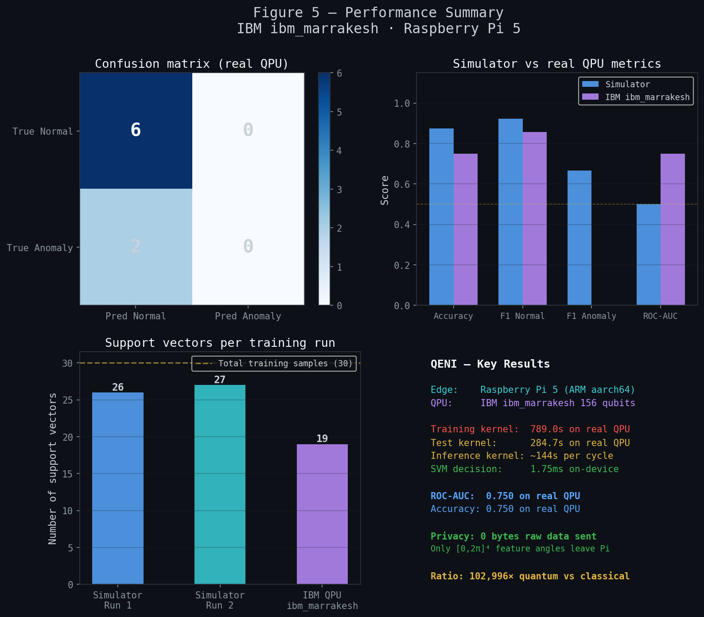
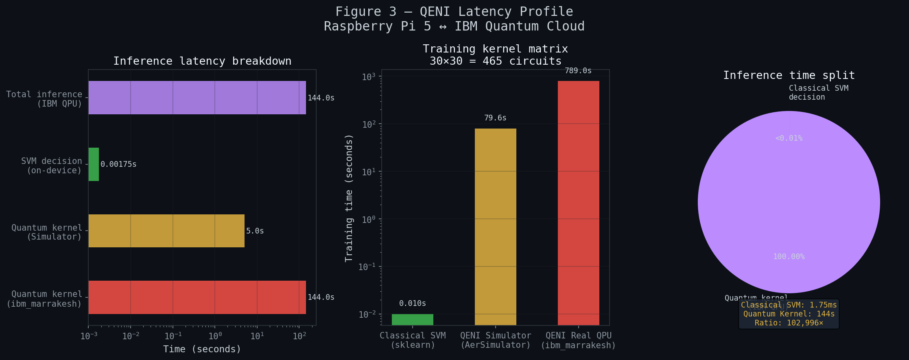

<div align="center">

# ⚛️ QENI — Quantum Edge Neural Inference

### Hybrid Quantum-Classical Inference on Raspberry Pi 5 + IBM Quantum Hardware

<p align="center">


</p>

<p align="center">
Experimental hybrid quantum-classical infrastructure research platform for edge-orchestrated anomaly inference.
</p>

</div>

---

# ⚛️ Overview

QENI is a distributed hybrid quantum-classical machine learning system that connects Raspberry Pi 5 edge infrastructure with real IBM Quantum hardware for anomaly detection and experimental quantum inference workflows.

The platform orchestrates quantum kernel computations on IBM superconducting quantum processors while performing local sensor processing and classification directly on lightweight ARM edge hardware.

---

# 🧠 What QENI Studies

QENI was designed as an experimental infrastructure research platform for studying:

* hybrid quantum-classical inference systems
* cloud-QPU orchestration
* edge AI workflows
* quantum kernel machine learning
* infrastructure-aware benchmarking
* operational latency behavior
* and distributed quantum execution pipelines

The project focuses on measuring realistic hybrid workflow behavior rather than claiming quantum advantage.

---

# 🖥️ System Architecture

The workflow consists of three layers:

## 🔹 Edge Layer — Raspberry Pi 5

* Reads telemetry streams
* Encodes features into quantum rotation angles
* Handles orchestration and inference logic
* Maintains local dashboard and logging
* Preserves raw sensor privacy

## 🔹 Quantum Cloud Layer — IBM Quantum

* Executes quantum kernel circuits
* Uses PauliFeatureMap-based feature encoding
* Computes quantum similarity values
* Returns kernel rows to the edge device

## 🔹 Inference Layer

* Runs SVM decision function locally
* Generates anomaly predictions
* Updates dashboard in real time
* Tracks latency and system metrics

---

# 📊 Experimental Results

## 📈 Performance Summary



---

## ⚡ Quantum vs Classical Latency



---

# 🔬 Core Experimental Finding

One of the most important observations from QENI is the infrastructure latency separation between quantum and classical computation layers.

| Layer                              | Latency  |
| ---------------------------------- | -------- |
| Classical SVM Decision (Pi 5)      | ~1.75 ms |
| Quantum Kernel Inference (IBM QPU) | ~144 s   |

This creates an approximately:

# 102,996× latency difference

between local classical inference and cloud quantum kernel execution.

Rather than hiding this overhead, QENI measures and exposes it directly as part of the experimental infrastructure analysis.

---

# 🧪 Machine Learning Pipeline

## 📡 Sensor Features

The system currently models:

* temperature
* vibration
* current draw
* acceleration magnitude

using multi-unit robot telemetry simulation.

---

## ⚛️ Quantum Feature Encoding

Sensor values are normalized into rotation angles between:

```math
0 \rightarrow 2\pi
```

These values are encoded into quantum circuits using:

* PauliFeatureMap
* entanglement layers
* compute-uncompute kernel estimation

Quantum kernel rows are generated using IBM Quantum hardware.

---

## 🧠 Classification Pipeline

A support vector machine with a precomputed quantum kernel performs anomaly classification locally on-device.

The system combines:

* cloud quantum execution
* edge orchestration
* and classical inference

within a single hybrid workflow.

---

# ⚙️ Hardware & Infrastructure

## 🖥️ Edge Hardware

* Raspberry Pi 5 (8GB)
* ARM Cortex-A76
* Raspberry Pi OS (64-bit)

## ⚛️ Quantum Backend

* IBM Quantum `ibm_marrakesh`
* 156-qubit superconducting quantum processor

## 🛠️ Software Stack

* Python 3.11
* Qiskit
* Qiskit Runtime
* scikit-learn
* NumPy
* Matplotlib
* Flask Dashboard

---

# 📉 Current Performance

| Metric                     | Result   |
| -------------------------- | -------- |
| Real QPU Accuracy          | 75%      |
| Simulator Accuracy         | 87.5%    |
| ROC-AUC                    | 0.750    |
| Support Vectors            | 19       |
| Training Kernel Execution  | 789 s    |
| Inference Kernel Execution | ~144 s   |
| Local SVM Decision         | ~1.75 ms |

---

# 🔍 Research Focus

QENI is not intended as a production-ready industrial deployment system.

Instead, the platform experimentally studies:

* quantum infrastructure behavior
* hybrid orchestration overhead
* cloud-QPU execution latency
* edge-to-quantum workflows
* and realistic operational constraints of current NISQ systems

The latency ratio itself is treated as a measurable infrastructure finding rather than a limitation to hide.

---

# 🚀 Future Directions

Planned extensions include:

* real physical sensor integration
* backend-aware intelligent scheduling
* adaptive quantum-classical orchestration
* latency prediction using AI models
* cross-backend benchmarking
* temporal kernel stability analysis
* distributed edge-node deployments
* and hybrid cloud-edge optimization workflows

---

# 📂 Repository Structure

```bash
qeni/
├── dashboard/
├── graphs/
├── logs/
├── models/
├── quantum/
├── telemetry/
├── inference/
├── training/
└── README.md
```

---

# ⚠️ Disclaimer

QENI is an experimental research and benchmarking platform intended for:

* infrastructure experimentation
* educational purposes
* hybrid systems research
* and quantum workflow analysis

It is NOT intended for:

* production deployment
* safety-critical robotics
* industrial fault prevention
* or enterprise operational environments

---

# 👨‍💻 Author

**Miriyala Varun Tej**
B.Tech CSE (IoT)
Quantum Systems & PQC Research

IBM Quantum Experiments • ARM Edge Infrastructure • Hybrid Quantum-Classical Systems

